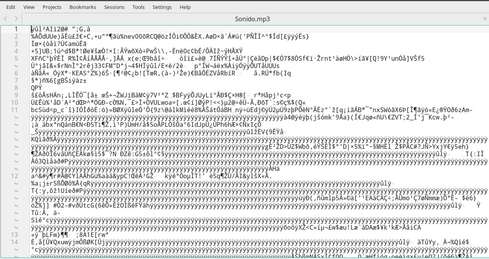

<!--Necesario-->
```{r setup, include=FALSE} 
knitr::opts_chunk$set(echo = TRUE)
```


# INTRODUCCIÓN

​		Antes de explicar el funcionamiento de Css es necesario conocer algunas de las cosas básicas de la informática:

## Texto plano

​		La gran inmensa mayoría de programación se desarrolla o es editada en un archivo de texto plano. Y, ¿Qué es esto de un archivo de texto plano? Un archivo de texto plano (del inglés :uk: : *plain text*) es un archivo que contiene exclusivamente caracteres, sin ningún formato; es decir sin negritas, itálicas subrayados, colores, tamaño de letra, fuente ...


​		Técnicamente cualquier archivo puede abrirse desde un editor de texto plano. Pero, por ejemplo si abriéramos un archivo .MP3 no entenderíamos su contenido.




*Foto de una archivo mp3 abierto con un editor de textos planos (Kate)*


​	Los tres grandes sistemas operativos tiene incluido un editor de textos plano como predeteriminado: MacOs tiene Text Edit, Windows tiene el mítico Bloc de Notas y en el caso de Linux/Unix tienen a nano o vim.

## Lenguajes de  Programación

​	Un lenguaje de programación es un lenguaje formal (o artificial, es decir, un lenguaje con reglas gramaticales bien definidas sintaxis, punto 1.3) que le proporciona a una persona, en este caso el programador, la capacidad de escribir (o programar) una serie de instrucciones o secuencias de órdenes en forma de algoritmos con el fin de controlar el comportamiento físico o lógico de un sistema informático, de manera que se puedan obtener diversas clases de datos o ejecutar determinadas tareas. A todo este conjunto de órdenes escritas mediante un lenguaje de programación se le denomina programa informático.

## Sintaxis

​	En programación, se llama sintaxis a la forma de escribir el código. Este ejemplo es muy claro.

```c++
//C++

cout << "Hola mundo" << endl;
```

```c#
//C#

console.log("Hola mundo\n");
```

​	En este ejemplo anterior los dos códigos, el primero es c++  y el segundo es c#; se muestra en la consola de comandos la frase "Hola Mundo" y se hace un salto de linea (*intro*). Y como podéis ver el resultado es el mismo pero la sintaxis, es decir, la forma de escribir el código cambia porque cambia el lenguaje

## Sintaxis de CSS y Funcionamineto

​	En este apartado se explicara el funcionamiento de Css y su sintaxis, pero, primero de todo hay que solucionar varios aspectos que pueden generar controversia. **Css se utiliza para dar formato a una web**, esto puede generar controversia, ya que los archivos Css son de texto plano, y como ya se ha explicado antes los archivos planos no pueden tener formato. No esta del todo claro que Css sea un lenguaje de programación, hay expertos que lo consideran como un lenguaje de progrmación por que tiene las caracteristicas de un lenguaje de programación; pero hay gente que dice que no es un lenguaje de programación porque se dice que le faltan las estructuras básicas de programación, como pueden ser las condicionales o los bucles. Dicho esto vamos a explicar el funcionamiento de css.

​	Este trozo de código hace que todos los texto_azul_con_margen tengan texto azul con margen.

```css
.texto_azul_con_margen{
    
    /*Esto es un comentario*/
    background-color: blue;
    
    margin:5px;
}
```

### Partes del Código

- ".texto_azul_con_margen" indica a que se le va aplicar el formato
- "{" Indica que se va a comenzar a definir el formato del elemento anterior
- "Esto es un comentario" es un ejemplo de comentario, los comentarios son anotaciones que puedes hacer en propio código sin que se altere el funcionamiento del mismo
- "background-color" y "margin" indican la característica del formato que se va a definir
- ":" los dos-puntos indican que se va definir el valor de la característica del formato
- El "blue" y el "5px" es el valor del formato definido, 5 px de margin y blue de backgorund color
- ";" Los punto-coma indican que se cambia de caracteristica de formato
- "}" Indica que se acaba el formato 

# FUNCIONAMIENTO

Antes de explicar el funcionamiento de Css es necesario conocer un minimo de conocimientos de html los cuales sera introsucidos a medida que avance la explicación de css.

Los elementos hacen refernecia a todo a lo que vamos a dar formatos, pueden ser de tres tipos: etiquetas, classes e Ides.ç

## Etiquetas

En html los componentes son introducidos con etiquetas un ejemplo es la etiqueta *table*

```html
<table>

  <tr>
    <td>
      NOMBRE
    </td>

    <td>
      TELEFONO
    </td>

  </tr>
  <tr>
    <td>
      Pepe
    </td>

    <td>
    0009000
    </td>

  </tr>

</table>

```
Las etiquetas son cualquier cosa entre los simbolos mayor-que y menor-que (<,>). Cada etiqueta crea un componente distinto, en el caso la etiqueta "table" crea la tabla, la etiqueta tr dice que se creé una nueva fila en la tabla y las etiquetas td crean una nueva celda dentro de la fila.

El resultado de este código seria el siguiente:

<table>

  <tr>
    <td>
      NOMBRE
    </td>

    <td>
      TELEFONO
    </td>

  </tr>
  <tr>
    <td>
      Pepe Cabrera Perez
    </td>

    <td>
    0009000
    </td>

  </tr>

</table>

Como se puede ver en la tabla anterior, la tabla no tiene ni bordes, ni margenes ni nada por el estilo. Esto ocurre porque no hay un archivo css que este indicando el formato que a de tener la tabla, para definir el formato de la tabla se haria de la siguiente forma.

```css

table{

border: solid black 2px;

}

```

Esto hace que todas las etiquetas table, es decir todas las tablas insertadas en la web tendran este formato.

### Etiquetas Más Típicas de html

Todas estas tienen que ir entre mayor y menor que:

<ul>

<li>**table**: Crea una tabla (*tbody)</li>
<li>**tr**: Crea una fila en una tabla</li>
<li>**td**: Crea una celda dentro de una fila</li>
<li>**tr**: Crea una celda con formato de titulo dentro de una fila</li>
<li>**a**: Crea un hípervinculo</li>
<li>**div**: Agrupa elementos</li>
<li>**button**: crea un boton</li>
<li>**body**: Agrupa todo el contenido de la web</li>
<li>**h#**: Los h son titulos, depende de el numero que pongas despues de la h sera la magnitud  del titulo, para hacer un titulo de magnitud 1 se pone h1 y para magnitud 2 h2...</li>
<li>**br**: Hace un salto de linea</li>
<li>**hr**: Hace una línea</li>
<li>**img**: Crea una imagen</li>

</ul>

## Clases
 
Las clases te permiten añadir formatos a determinadas etiqueta, primero has de asignar formato a la clase y después has de añadir a la etiqueta que deseas que tenga el formato de la clase, para muestra un botón:

```css
.Boton_Fin_Juego{

font-family: 23px;

}

```

Este codigo hace que todas las etiquetas que tengan asignadas la clase "Boton_Fin_Juego" tengan las caracteristicas de esta clase. <br>

Es importante piner el punto en la hoja de css para que el interprete lo interprete como una clase en vez de una etiqueta.

<br>

Puedes asignar a varias etiquetas la misma clase.

## Id

Una id es exactamente igual que una clase, la unica diferencia es que solo se puede asignar a una etiquetas

```css
#Afirmacion{

font-family: "Arial";

}
```

Aquí en vez de poner un punto hay que poner un hashtag/amohadilla/bemol.